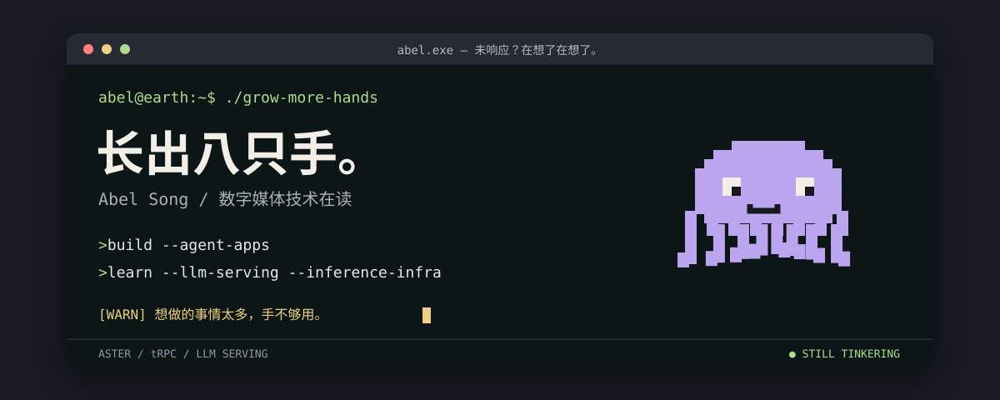

  

### 🐙 手不够用，但还在折腾

**Aster**：给自己养的 AI 助手。日常对话、文件记忆、知识检索和长期任务放在同一个工作空间里，要求就一条：干活可以，别吵我。

Python · LangGraph · PostgreSQL · 个人项目，仓库暂未公开

 

**[Craving](https://github.com/Adonis-a233/Craving)**：美食社区平台的后端。发帖、评论、关注之外，做了三块硬一点的：WebSocket 即时通讯（端到端加密、幂等去重、离线补发）、图文混合的向量搜索（ES kNN + RRF）、多路召回的推荐流水线。

Spring Boot 3 · Java 21 · MySQL · Redis · RabbitMQ · Elasticsearch

### 给别家仓库交过的 PR

- **[west2-online/learn-backend](https://github.com/west2-online/learn-backend/pulls?q=is%3Apr+is%3Amerged+author%3AAdonis-a233)**：7 个 merged PR，从空仓库搭起六轮后端考核文档。 之前我还是[交考核作业的那个](https://github.com/west2-online-reserve/collection-java/pulls?q=is%3Apr+author%3AAdonis-a233)。
- **[trpc-agent-python](https://github.com/trpc-group/trpc-agent-python/pull/99)**：给 Agent 出卷子、整理错题本，一套可复现的评测流程，从跑基线、找失败原因，到优化复验、报告留档。已关闭，未合并。
- **[Tasty 美食平台](https://github.com/yewangxiang/Tasty-Local-Food-Discovery-Sharing-Platform/pull/1)**（团队项目）：核心服务可靠性优化，已合并。

顺手修过 [apache/shenyu-website](https://github.com/apache/shenyu-website/pulls?q=is%3Apr+is%3Amerged+author%3AAdonis-a233) 的两处文档：AI proxy API key 说明、JDK 版本要求。

### 还在学

**LLM Serving / 推理 Infra**：怎么把模型跑起来，以及为什么它跑得不够快。目前只有投入，没有能展示的成果。

---

本页没有八只手，只有一个还在折腾的人。 / Visual adapted from <a href="https://github.com/beydemirfurkan/awesome-github-profile/tree/main/templates/02-animated/typewriter-intro">Typewriter Intro</a>.
