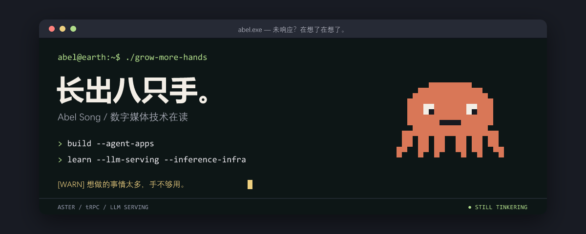

  

### 🗃️ 存档点

<table>
<tr>
<td width="50%" valign="top">
01 / 正在养成
<h3>🐙 Aster</h3>

试图养出一个能帮忙、又不会一直吵我的 AI 助手。

<code>Python</code> <code>LangGraph</code> <code>PostgreSQL</code>

个人项目 · 仓库暂未公开
</td>
<td width="50%" valign="top">
02 / 给 Agent 改作业
<h3><a href="https://github.com/trpc-group/trpc-agent-python">🧪 tRPC-Agent-Python ↗</a></h3>

提交过可复现的 Evaluation + Optimization 流程：评测、失败归因、优化、验证与报告留档。

<code>Evaluation</code> <code>Optimization</code>

</td>
</tr>
</table>

> **🎮 当前支线：LLM Serving / 推理 Infra** 
> 正在学习怎么把模型跑起来，以及为什么它跑得不够快。

 

### 🕹️ 营业记录

  

  

  

👣 还有些散落的脚印

- [West2 Online](https://github.com/west2-online/learn-backend/pulls?q=is%3Apr+is%3Amerged+author%3AAdonis-a233)：后端学习资料与项目考核。
- Apache ShenYu 文档：[AI proxy API key](https://github.com/apache/shenyu-website/pull/1114)、[JDK 要求](https://github.com/apache/shenyu-website/pull/1115)。

