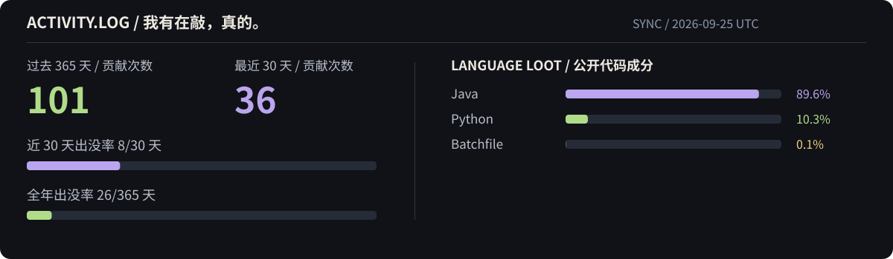

  

### 🐙 手不够用，但还在折腾

<table>
<tr>
<td width="50%" valign="top">
01 / 正在养成
<h3>🐙 Aster</h3>

试图养出一个能帮忙、又不会一直吵我的 AI 助手。日常对话、文件记忆、知识检索和长期任务，放在同一个工作空间里。

<code>Python</code> <code>LangGraph</code> <code>PostgreSQL</code>

个人项目 · 仓库暂未公开
</td>
<td width="50%" valign="top">
02 / 给 Agent 改作业
<h3><a href="https://github.com/trpc-group/trpc-agent-python">🧪 tRPC-Agent-Python ↗</a></h3>

给 Agent 出卷子，也给它整理错题本：一套可复现的 Evaluation + Optimization 流程，评测、归因、优化、复验、留档。

<code>Evaluation</code> <code>Optimization</code>

<a href="https://github.com/trpc-group/trpc-agent-python/pull/99">方案与代码 / PR #99 ↗</a> · 已关闭，未合并
</td>
</tr>
</table>

> **🎮 当前支线：LLM Serving / 推理 Infra** 
> 正在学习怎么把模型跑起来，以及为什么它跑得不够快。

 

### 🕹️ 营业记录

私有 Aster 不参与语言统计；语言条是公开代码量，不是技能熟练度。

  

**下面这条蛇，负责吃掉我种的草。**

  

每天自动投喂 · <a href="https://github.com/Adonis-a233/Adonis-a233/actions/workflows/profile-activity.yml">查看更新时间 ↗</a>

  

👣 还有些散落的脚印

- [west2-online/learn-backend](https://github.com/west2-online/learn-backend/pulls?q=is%3Apr+is%3Amerged+author%3AAdonis-a233)：7 个 merged PR，从空仓库开始搭了六轮后端考核文档。更早的时候，我还是[交考核作业的那个](https://github.com/west2-online-reserve/collection-java/pulls?q=is%3Apr+author%3AAdonis-a233)。
- [Tasty 美食平台](https://github.com/yewangxiang/Tasty-Local-Food-Discovery-Sharing-Platform/pull/1)（团队项目）：一次核心服务可靠性优化，已合并。
- Apache ShenYu 文档：[AI proxy API key](https://github.com/apache/shenyu-website/pull/1114)、[JDK 要求](https://github.com/apache/shenyu-website/pull/1115)。

---

本页没有八只手，只有一个还在折腾的人。 Visual: <a href="https://github.com/beydemirfurkan/awesome-github-profile/tree/main/templates/02-animated/typewriter-intro">Typewriter Intro</a> · Snake: <a href="https://github.com/Platane/snk">Platane/snk</a>
