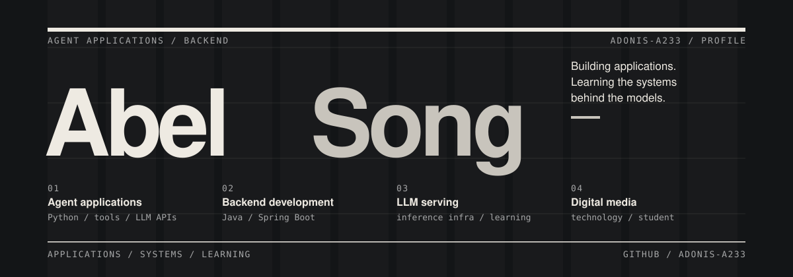

<picture>
  <source media="(prefers-color-scheme: dark)" srcset="./assets/swiss-grid-dark.svg">
  <source media="(prefers-color-scheme: light)" srcset="./assets/swiss-grid-light.svg">
  
</picture>

 

### Selected work

<table>
<tr>
<td width="50%" valign="top">
01 / AGENT APPLICATIONS
<h3><a href="https://github.com/Adonis-a233/Agent_demo">Agent Demo ↗</a></h3>

A Python learning project for tool use, session isolation, and conversation summarization through an OpenAI-compatible API.

<code>Python</code> <code>LLM APIs</code>

Learning project · search and weather use mock data.
</td>
<td width="50%" valign="top">
02 / COMMUNITY BACKEND
<h3><a href="https://github.com/Adonis-a233/Craving">Craving ↗</a></h3>

A food-community backend with social interactions, WebSocket messaging, vector search, and recommendation modules.

<code>Java</code> <code>Spring Boot</code> <code>MySQL</code>

Redis · Elasticsearch · RabbitMQ
</td>
</tr>
</table>

### Open-source contributions

**[West2 Online](https://github.com/west2-online/learn-backend)** · Backend learning materials and project assessments. [Merged work ↗](https://github.com/west2-online/learn-backend/pulls?q=is%3Apr+is%3Amerged+author%3AAdonis-a233)

**[Apache ShenYu](https://github.com/apache/shenyu-website)** · Documentation corrections for [AI proxy API keys](https://github.com/apache/shenyu-website/pull/1114) and [JDK requirements](https://github.com/apache/shenyu-website/pull/1115).

---

<a href="https://github.com/Adonis-a233?tab=repositories">ALL REPOSITORIES ↗</a> &nbsp; / &nbsp; Based on <a href="https://github.com/beydemirfurkan/awesome-github-profile/tree/main/templates/11-swiss-brutalist/swiss-grid">Swiss Grid</a>
